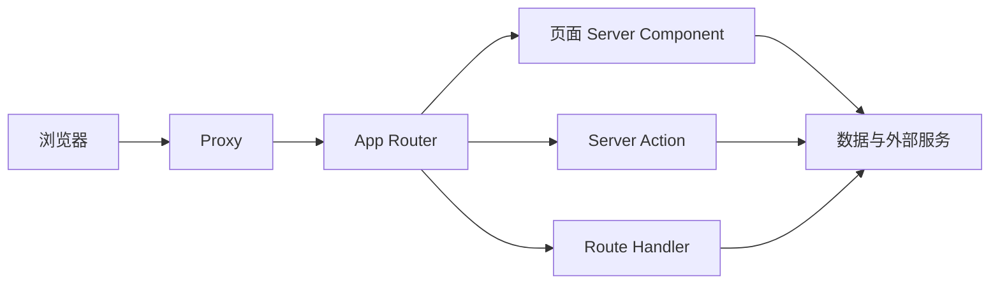

# 项目笔记

本项目开发过程中的学习笔记。

## 1、Next.js 全栈框架

- Next.js 把 React 界面和服务器能力放在同一个项目里
- 浏览器收到的是已经渲染的页面
- 读取数据、校验输入、写入数据库都发生在服务器上，因此不需要再单独部署一套后端。

一次请求的路径可以概括为：




Proxy 在页面渲染之前拦截请求，适合做跳转。通过之后，由 App Router 按 URL 分发：打开页面走 Server Component，提交表单走 Server Action，访问 HTTP 接口走 Route Handler。三者都可以在服务器上接触数据库和密钥。

### 设计理念

1、文件系统路由

- 文件夹结构决定 URL 路径。不需要单独写一份路由配置，只要在 app/ 目录下创建文件夹和特定文件，路由就自动生成
- 每个文件夹代表一个路由段（Route Segment），嵌套文件夹形成嵌套路由
- 只要文件夹里存在 page.tsx 或 route.ts，这个路由就是公开可访问的
- 新项目应该使用 App Router，Pages Router 仅用于维护旧项目

2、Server First——默认服务端组件，只在需要交互的地方引入客户端组件

- App Router 中，所有布局和页面默认都是服务端组件
- 当组件需要状态、事件处理、浏览器 API 或生命周期逻辑时，在文件顶部加上 'use client' ，就变成了客户端组件
- Server Component 负责获取数据，把数据作为 props 传给 Client Component 负责交互

3、渲染模式

- SSG（Static Site Generation），	构建时生成HTML
- SSR（Server-Side Rendering），每次请求时生成HTML
- ISR（Incremental Static Regeneration），构建时 + 按需重新生成HTML
- CSR（Client-Side Rendering），浏览器运行时生成HTML

传统的 SSR 必须等所有数据都获取完才能发送完整的 HTML，一个慢查询就会阻塞整个页面。Next.js使用【流式渲染】通过分块传输编码改变了这一点。

4、多层缓存

- 从请求到路由到客户端，尽可能复用计算结果


### 基本组件


| 组件               | 作用                                                                                |
| ---------------- | --------------------------------------------------------------------------------- |
| App Router       | `app/` 目录即路由。一个文件夹对应一段 URL，`page.tsx` 是该地址的页面。带括号的目录（如 `(auth)`）只用于分组，不出现在 URL 里。 |
| Layout           | `layout.tsx` 包裹其子路由，放置全站或某一组页面共用的外壳（字体、标题、外框）。切换子页面时布局保持不变。                       |
| Server Component | 默认的页面组件，在服务器上执行。可以直接读取数据并生成 HTML，这部分逻辑不会进入浏览器。                                    |
| Client Component | 标为客户端的组件，在浏览器中运行。负责输入、按钮状态、提交过程中的提示等需要交互的界面。                                      |
| Server Action    | 在服务器上执行的函数，由表单或客户端组件直接调用。适合登录、发留言这类写入操作，调用方不需要手写 HTTP 请求。                         |
| Route Handler    | `route.ts` 暴露标准的 HTTP 接口（GET、POST 等）。适合交给认证库、第三方或非页面客户端调用。                        |
| Loading / Error  | `loading.tsx` 在页面等待数据时显示占位；`error.tsx` 在渲染失败时显示可恢复的错误界面。                          |
| Proxy            | `proxy.ts` 在请求进入页面之前运行。本框架用它做路由级判断（例如未登录则跳转），不在这里执行完整业务。                          |
| 渲染方式             | 不依赖请求的页面可以在构建时生成；依赖登录态、Cookie 或实时查询的页面在每次请求时渲染。写入成功后，可以让相关页面重新取数。                 |


Server Component 负责“看”，Server Action 和 Route Handler 负责“改”或对外提供 HTTP。客户端组件只保留交互，数据规则留在服务器。

## 2、Better Auth

- 用于用户认证，是一个可安装的 npm 包，不是一个可以直接访问的托管服务。
- 核心能力是实现了【 密码哈希 / 会话创建与验证 / OAuth 流程 / 插件系统】等能力
- 在应用中安装 Better Auth 之后，利用这个包来分别构建 Auth 客户端和服务端，通过 HTTP 实现认证功能
- 全栈项目中可以不需要客户端，直接在代码中访问服务端（本项目中通过 Server Action 直接访问）

相关的认证服务：


| 类型     | 代表                         | 你的数据在哪  | 你需要做什么               |
| ------ | -------------------------- | ------- | -------------------- |
| 托管认证服务 | Auth0、Clerk、Firebase Auth  | 厂商的服务器  | 注册账号、拿 API Key、调厂商接口 |
| 自托管认证库 | Better Auth、Lucia、NextAuth | 你自己的数据库 | 安装库、配置数据库、自己部署       |


## 3、Prisma

Prisma 是一个开源、可自行安装和部署的 ORM 库，不是一个托管服务。

使用流程

1、安装依赖：安装 Prisma CLI（开发依赖）以及 Prisma Client 和对应数据库的驱动适配器。

```
npm install prisma --save-dev
npm install @prisma/client @prisma/adapter-pg pg
（这里以 PostgreSQL 为例，其他数据库需替换为对应的适配器）
```

2、初始化项目：运行 `npx prisma init`，这会创建 prisma/schema.prisma 文件和 .env 文件。

3、配置数据库连接：在项目根目录创建 prisma.config.ts 文件，并配置 datasource，通常从环境变量读取 DATABASE_URL。

4、定义数据模型：在 prisma/schema.prisma 文件中，使用 Prisma Schema Language (PSL) 定义你的数据模型（即数据表结构）。

5、生成 Prisma Client：运行以下命令，Prisma 会根据你的模型定义生成类型安全的客户端代码。

```
npx prisma generate
```

6、创建并应用数据库迁移：运行以下命令，Prisma Migrate 会根据你的模型定义生成 SQL 迁移文件，并应用到数据库中，从而在数据库里实际创建出对应的表。

```
npx prisma migrate dev --name init
```

7、在应用代码中使用：从生成器指定的输出路径导入 PrismaClient，实例化后即可进行数据库操作。

```
import { PrismaClient } from '../src/generated/prisma';
const prisma = new PrismaClient();

const users = await prisma.user.findMany();
```

